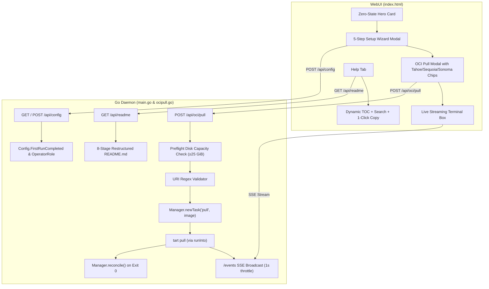

# Tart Oven Onboarding Wizard, Direct OCI Pull & Helper Guide Overhaul Implementation Plan

> **For agentic workers:** REQUIRED SUB-SKILL: Use superpowers:subagent-driven-development to implement this plan task-by-task. Steps use checkbox (`- [ ]`) syntax for tracking.

**Goal:** Provide an integrated onboarding wizard, direct in-app OCI image pull capability with live SSE streaming, and an interactive 8-stage technical helper guide with Jamf Pro random serial/MAC requirements.

**Architecture:** A dedicated `ocipull.go` subsystem validates OCI image URIs, enforces a 25 GiB free disk preflight check, and streams `tart pull` tasks through Go background goroutines into the existing `/events` SSE pipeline. `main.go` extends `Config` with `FirstRunCompleted` and `OperatorRole`, while `index.html` implements the 5-step guided setup modal, dashboard empty-state hero cards, and an interactive markdown viewer with TOC sidebar, live search, and 1-click copyable snippets.

**Architecture Diagram:**



**Tech Stack:** Go 1.24 (single `main` package), Vanilla JavaScript / HTML5 in `index.html`, Tart CLI (`tart pull`), Node.js `node:test`.

**Spec:** [`docs/superpowers/specs/2026-08-25-onboarding-oci-pull-and-guide-design.md`](file:///Users/rob/Documents/tart-oven-main/docs/superpowers/specs/2026-08-25-onboarding-oci-pull-and-guide-design.md)

## Global Constraints

- Single `main` package at the repo root.
- All background tasks execute inside the persistent Go daemon (`m.tasks`) and survive browser refreshes.
- Curated presets strictly provide macOS base images (Tahoe 26, Sequoia 15, Sonoma 14) and custom registry URLs.
- Cloned VMs intended for Jamf Pro / MDM enrollment must document and enforce `--random-serial` and `--random-mac`.
- Keep `go test ./...` and `node --test index_ui_test.js` passing.

---

### Task 1: OCI URI validation & disk capacity pre-flight check

**Files:**
- Create: `ocipull.go`
- Create: `ocipull_test.go`

**Interfaces:**
- Produces:
  - `validateOCIImageURI(raw string) (string, error)`
  - `checkFreeDiskSpace(storagePath string, minBytes uint64) (uint64, error)`

- [ ] **Step 1: Write the failing tests**

Create `ocipull_test.go`:
```go
package main

import (
	"os"
	"strings"
	"testing"
)

func TestValidateOCIImageURI(t *testing.T) {
	valid := []string{
		"ghcr.io/cirruslabs/macos-sonoma-base:latest",
		"ghcr.io/cirruslabs/macos-sequoia-base:latest",
		"ghcr.io/cirruslabs/macos-tahoe-base:latest",
		"docker.io/library/macos:15",
		"registry.internal.corp/team/macos-runner:v1.2",
	}
	for _, u := range valid {
		got, err := validateOCIImageURI(u)
		if err != nil || got != u {
			t.Errorf("validateOCIImageURI(%q) unexpected error: %v, got: %q", u, err, got)
		}
	}

	invalid := []string{
		"",
		"   ",
		"ghcr.io/cirruslabs/macos-sonoma-base; rm -rf /",
		"image with spaces",
		"ghcr.io/`touch bad`",
		"image$(whoami)",
		"http://ghcr.io/image:latest",
	}
	for _, u := range invalid {
		if _, err := validateOCIImageURI(u); err == nil {
			t.Errorf("validateOCIImageURI(%q) expected error but passed", u)
		}
	}
}

func TestCheckFreeDiskSpace(t *testing.T) {
	tempDir, err := os.MkdirTemp("", "ocipull-disk-test")
	if err != nil {
		t.Fatal(err)
	}
	defer os.RemoveAll(tempDir)

	// Host should have at least 1000 bytes free
	free, err := checkFreeDiskSpace(tempDir, 1000)
	if err != nil {
		t.Fatalf("checkFreeDiskSpace unexpected error: %v", err)
	}
	if free == 0 {
		t.Errorf("expected non-zero free space")
	}

	// Insufficient space check with an impossibly large requirement (100 Petabytes)
	const impossible = 100 * 1024 * 1024 * 1024 * 1024 * 1024
	_, err = checkFreeDiskSpace(tempDir, impossible)
	if err == nil || !strings.Contains(err.Error(), "insufficient disk space") {
		t.Errorf("expected insufficient disk space error, got: %v", err)
	}
}
```

- [ ] **Step 2: Run tests to verify they fail**

Run: `go test ./... -run 'TestValidateOCIImageURI|TestCheckFreeDiskSpace' -v`  
Expected: FAIL with `undefined: validateOCIImageURI`, `undefined: checkFreeDiskSpace`

- [ ] **Step 3: Implement validation and disk check**

Create `ocipull.go`:
```go
package main

import (
	"errors"
	"fmt"
	"regexp"
	"strings"
	"syscall"
)

var ociImageRegex = regexp.MustCompile(`^[a-zA-Z0-9_.-]+(/[a-zA-Z0-9_.-]+)+(:[a-zA-Z0-9_.-]+)?$`)

// minPullFreeBytes is 25 GiB
const minPullFreeBytes uint64 = 25 * 1024 * 1024 * 1024

// validateOCIImageURI validates and sanitizes an OCI image reference.
func validateOCIImageURI(raw string) (string, error) {
	raw = strings.TrimSpace(raw)
	if raw == "" {
		return "", errors.New("image URI cannot be empty")
	}
	if strings.ContainsAny(raw, " \t\n\r;|&`$><(){}[]\\\"'") {
		return "", errors.New("image URI contains invalid characters")
	}
	if strings.HasPrefix(raw, "http://") || strings.HasPrefix(raw, "https://") {
		return "", errors.New("image URI must not include http:// or https:// protocol scheme")
	}
	if !ociImageRegex.MatchString(raw) {
		return "", fmt.Errorf("invalid OCI image reference format: %q", raw)
	}
	return raw, nil
}

// checkFreeDiskSpace checks available bytes on the filesystem backing path.
func checkFreeDiskSpace(path string, minBytes uint64) (uint64, error) {
	var stat syscall.Statfs_t
	if err := syscall.Statfs(path, &stat); err != nil {
		return 0, fmt.Errorf("statfs %s: %w", path, err)
	}
	freeBytes := stat.Bavail * uint64(stat.Bsize)
	if freeBytes < minBytes {
		return freeBytes, fmt.Errorf("insufficient disk space: %d GB available, requires at least %d GB", freeBytes/(1024*1024*1024), minBytes/(1024*1024*1024))
	}
	return freeBytes, nil
}
```

- [ ] **Step 4: Run tests to verify they pass**

Run: `go test ./... -run 'TestValidateOCIImageURI|TestCheckFreeDiskSpace' -v`  
Expected: PASS

- [ ] **Step 5: Commit**

```bash
git add ocipull.go ocipull_test.go
git commit -m "feat(oci): add OCI image URI validator and free disk capacity preflight check"
```

---

### Task 2: Direct OCI pull backend endpoint & streaming execution

**Files:**
- Modify: `main.go`
- Modify: `ocipull.go`
- Modify: `ocipull_test.go`

**Interfaces:**
- Consumes: `validateOCIImageURI`, `checkFreeDiskSpace`, `m.newTask`, `m.runInto`, `m.reconcile`
- Produces: `POST /api/oci/pull` endpoint

- [ ] **Step 1: Write the failing tests**

Add to `ocipull_test.go`:
```go
import (
	"bytes"
	"encoding/json"
	"net/http"
	"net/http/httptest"
)

func TestHandleOCIPull(t *testing.T) {
	m := newTestManager(t)
	mux := m.routes()

	// 1. Invalid payload
	req := httptest.NewRequest(http.MethodPost, "/api/oci/pull", bytes.NewBufferString(`{"image":"bad;image"}`))
	rec := httptest.NewRecorder()
	mux.ServeHTTP(rec, req)
	if rec.Code != http.StatusBadRequest {
		t.Fatalf("expected 400 Bad Request, got %d", rec.Code)
	}

	// 2. Valid payload starts task
	validBody, _ := json.Marshal(ociPullReq{
		Image: "ghcr.io/cirruslabs/macos-sonoma-base:latest",
	})
	req = httptest.NewRequest(http.MethodPost, "/api/oci/pull", bytes.NewBuffer(validBody))
	rec = httptest.NewRecorder()
	mux.ServeHTTP(rec, req)
	if rec.Code != http.StatusOK {
		t.Fatalf("expected 200 OK, got %d: %s", rec.Code, rec.Body.String())
	}
	var res map[string]interface{}
	if err := json.Unmarshal(rec.Body.Bytes(), &res); err != nil || res["ok"] != true {
		t.Fatalf("unexpected response: %v", rec.Body.String())
	}

	// 3. Duplicate pull prevention
	req = httptest.NewRequest(http.MethodPost, "/api/oci/pull", bytes.NewBuffer(validBody))
	rec = httptest.NewRecorder()
	mux.ServeHTTP(rec, req)
	if rec.Code != http.StatusConflict {
		t.Fatalf("expected 409 Conflict for duplicate pull, got %d", rec.Code)
	}
}
```

- [ ] **Step 2: Run test to verify it fails**

Run: `go test ./... -run 'TestHandleOCIPull' -v`  
Expected: FAIL with `undefined: ociPullReq` or 404 Not Found

- [ ] **Step 3: Implement endpoint and task handling in `ocipull.go` and `main.go`**

Add to `ocipull.go`:
```go
package main

import (
	"encoding/json"
	"io"
	"net/http"
)

type ociPullReq struct {
	Image    string `json:"image"`
	Insecure bool   `json:"insecure"`
}

func (m *Manager) isPullRunning(image string) bool {
	m.mu.Lock()
	defer m.mu.Unlock()
	for _, t := range m.tasks {
		if t.Kind == "pull" && t.Target == image && t.Status == "running" {
			return true
		}
	}
	return false
}

func (m *Manager) handleOCIPull(w http.ResponseWriter, r *http.Request) {
	if r.Method != http.MethodPost {
		http.Error(w, "method not allowed", http.StatusMethodNotAllowed)
		return
	}
	body, err := io.ReadAll(r.Body)
	if err != nil {
		http.Error(w, err.Error(), http.StatusBadRequest)
		return
	}
	var req ociPullReq
	if err := json.Unmarshal(body, &req); err != nil {
		http.Error(w, err.Error(), http.StatusBadRequest)
		return
	}
	image, err := validateOCIImageURI(req.Image)
	if err != nil {
		http.Error(w, err.Error(), http.StatusBadRequest)
		return
	}

	if m.isPullRunning(image) {
		http.Error(w, "a pull for this image is already in progress", http.StatusConflict)
		return
	}

	storageDir := m.storage()
	if _, err := checkFreeDiskSpace(storageDir, minPullFreeBytes); err != nil {
		http.Error(w, err.Error(), http.StatusInsufficientStorage)
		return
	}

	t := m.newTask("pull", image)
	m.broadcast()

	go func() {
		args := []string{"pull"}
		if req.Insecure {
			args = append(args, "--insecure")
		}
		args = append(args, image)

		err := m.runInto(t, args...)
		m.finishTask(t, err)
		if err == nil {
			m.reconcile()
		}
		m.broadcast()
	}()

	writeJSON(w, map[string]interface{}{
		"ok":     true,
		"taskId": t.ID,
		"image":  image,
	})
}
```

In `main.go`, register the route in `routes()`:
```go
mux.HandleFunc("/api/oci/pull", m.handleOCIPull)
```

- [ ] **Step 4: Run tests to verify they pass**

Run: `go test ./... -run 'TestHandleOCIPull' -v`  
Expected: PASS

- [ ] **Step 5: Commit**

```bash
git add main.go ocipull.go ocipull_test.go
git commit -m "feat(oci): add POST /api/oci/pull endpoint with duplicate checks and async task execution"
```

---

### Task 3: OCI Pull UI modal & macOS preset chips

**Files:**
- Modify: `index.html`
- Modify: `index_ui_test.js`

**Interfaces:**
- Modal ID: `#pullOciModal`
- Presets: `ghcr.io/cirruslabs/macos-tahoe-base:latest`, `ghcr.io/cirruslabs/macos-sequoia-base:latest`, `ghcr.io/cirruslabs/macos-sonoma-base:latest`
- Functions: `openPullOciModal()`, `closePullOciModal()`, `submitOciPull()`

- [ ] **Step 1: Write the failing UI tests**

Add to `index_ui_test.js`:
```javascript
test("Pull OCI modal contains required controls and macOS preset chips", () => {
  const requiredElements = [
    'id="pullOciModal"',
    'id="pullOciBtn"',
    'id="ociImageInput"',
    'id="ociInsecureChk"',
    'id="pullOciSubmit"',
    'id="pullOciCancel"',
    'id="pullOciLog"',
    'data-oci-preset="ghcr.io/cirruslabs/macos-tahoe-base:latest"',
    'data-oci-preset="ghcr.io/cirruslabs/macos-sequoia-base:latest"',
    'data-oci-preset="ghcr.io/cirruslabs/macos-sonoma-base:latest"',
  ];
  for (const el of requiredElements) {
    assert.ok(html.includes(el), `index.html missing element ${el}`);
  }
});
```

- [ ] **Step 2: Run test to verify it fails**

Run: `node --test index_ui_test.js`  
Expected: FAIL with missing `#pullOciModal` elements

- [ ] **Step 3: Implement OCI pull modal and JS handlers in `index.html`**

Add the modal dialog `#pullOciModal` to `index.html`:
```html
<div id="pullOciModal" class="modal-backdrop hidden" onclick="if(event.target===this)closePullOciModal()">
  <div class="modal card" style="max-width:580px; width:90%;">
    <div class="card-header" style="display:flex; justify-content:space-between; align-items:center;">
      <h3 style="margin:0;">⇩ Pull OCI Base Image</h3>
      <button class="btn btn-ghost" onclick="closePullOciModal()" style="font-size:1.2rem; padding:0 8px;">✕</button>
    </div>
    <div class="card-body">
      <div class="muted" style="margin-bottom:12px;">Select a curated macOS base image or specify a custom registry URL:</div>
      <div class="preset-chips" style="display:flex; gap:8px; flex-wrap:wrap; margin-bottom:14px;">
        <button type="button" class="btn btn-sm btn-outline oci-chip" data-oci-preset="ghcr.io/cirruslabs/macos-tahoe-base:latest" onclick="selectOciPreset(this)">🍏 macOS 26 (Tahoe)</button>
        <button type="button" class="btn btn-sm btn-outline oci-chip" data-oci-preset="ghcr.io/cirruslabs/macos-sequoia-base:latest" onclick="selectOciPreset(this)">🍏 macOS 15 (Sequoia)</button>
        <button type="button" class="btn btn-sm btn-outline oci-chip" data-oci-preset="ghcr.io/cirruslabs/macos-sonoma-base:latest" onclick="selectOciPreset(this)">🍏 macOS 14 (Sonoma)</button>
      </div>
      <div class="form-group" style="margin-bottom:12px;">
        <label for="ociImageInput" style="display:block; margin-bottom:4px; font-weight:600;">Image Registry URL</label>
        <input type="text" id="ociImageInput" class="input mono" placeholder="ghcr.io/cirruslabs/macos-sequoia-base:latest" style="width:100%;">
      </div>
      <div class="form-group" style="margin-bottom:14px;">
        <label style="display:flex; align-items:center; gap:6px; cursor:pointer; font-size:0.9rem;">
          <input type="checkbox" id="ociInsecureChk"> Allow untrusted / HTTP registry (--insecure)
        </label>
      </div>
      <div id="pullOciLogContainer" class="hidden" style="margin-top:12px;">
        <div style="font-weight:600; font-size:0.85rem; margin-bottom:4px;">Pull Progress Output:</div>
        <pre id="pullOciLog" class="mono" style="background:var(--card-bg, #111); padding:10px; border-radius:6px; max-height:160px; overflow-y:auto; font-size:0.8rem; border:1px solid var(--border); color:var(--text);"></pre>
      </div>
    </div>
    <div class="card-footer" style="display:flex; justify-content:flex-end; gap:8px; margin-top:16px;">
      <button type="button" id="pullOciCancel" class="btn btn-secondary" onclick="closePullOciModal()">Close</button>
      <button type="button" id="pullOciSubmit" class="btn btn-primary" onclick="submitOciPull()">Pull Image</button>
    </div>
  </div>
</div>
```

Add button in `#ociPanel` and JavaScript functions:
```javascript
function openPullOciModal() {
  const modal = document.getElementById("pullOciModal");
  if (modal) modal.classList.remove("hidden");
  document.getElementById("ociImageInput").focus();
}

function closePullOciModal() {
  const modal = document.getElementById("pullOciModal");
  if (modal) modal.classList.add("hidden");
}

function selectOciPreset(btn) {
  const preset = btn.dataset.ociPreset;
  const input = document.getElementById("ociImageInput");
  if (input && preset) {
    input.value = preset;
    input.focus();
  }
}

async function submitOciPull() {
  const image = (document.getElementById("ociImageInput").value || "").trim();
  const insecure = document.getElementById("ociInsecureChk").checked;
  if (!image) {
    toast("OCI Pull", "Please enter an OCI image reference or pick a preset.", "bad");
    return;
  }
  const submitBtn = document.getElementById("pullOciSubmit");
  submitBtn.disabled = true;
  submitBtn.textContent = "Starting Pull...";
  try {
    const res = await api("/api/oci/pull", {
      method: "POST",
      headers: { "Content-Type": "application/json" },
      body: JSON.stringify({ image, insecure })
    });
    const data = await res.json();
    if (!res.ok) throw new Error(data.error || "Failed to start OCI pull");
    toast("OCI Pull", "Pull task started for " + image, "good");
    document.getElementById("pullOciLogContainer").classList.remove("hidden");
    submitBtn.textContent = "Pulling...";
  } catch (err) {
    toast("OCI Pull Failed", err.message, "bad");
    submitBtn.disabled = false;
    submitBtn.textContent = "Pull Image";
  }
}
```

- [ ] **Step 4: Run tests to verify they pass**

Run: `node --test index_ui_test.js`  
Expected: PASS

- [ ] **Step 5: Commit**

```bash
git add index.html index_ui_test.js
git commit -m "feat(ui): add Pull OCI Image modal with macOS Tahoe, Sequoia, and Sonoma presets"
```

---

### Task 4: Helper Guide 8-Stage documentation overhaul in `README.md`

**Files:**
- Modify: `README.md`
- Create: `readme_test.go`

**Interfaces:**
- 8 Stages:
  1. Welcome & Value Proposition
  2. Quickstart 5-Minute Onboarding Guide
  3. Base Image Management & OCI Registry Workflow
  4. Daily Fleet Operations, Screen Sharing & Automation Scheduler
  5. Jamf Pro & MDM Administrator Toolkit (with mandatory `--random-serial` / `--random-mac` rule)
  6. Host Performance, Kernel Safeguards & Hardware Tuning
  7. Automation & REST / SSE API Reference
  8. Diagnostic Runbooks & Troubleshooting FAQ (with Jamf device collision runbook)

- [ ] **Step 1: Write the failing tests**

Create `readme_test.go`:
```go
package main

import (
	"os"
	"strings"
	"testing"
)

func TestReadmeContains8StagesAndMDMRandomization(t *testing.T) {
	b, err := os.ReadFile("README.md")
	if err != nil {
		t.Fatal(err)
	}
	content := string(b)

	stages := []string{
		"Stage 1: Welcome & Value Proposition",
		"Stage 2: Quickstart 5-Minute Onboarding Guide",
		"Stage 3: Base Image Management & OCI Registry Workflow",
		"Stage 4: Daily Fleet Operations, Screen Sharing & Automation Scheduler",
		"Stage 5: Jamf Pro & MDM Administrator Toolkit",
		"Stage 6: Host Performance, Kernel Safeguards & Hardware Tuning",
		"Stage 7: Automation & REST / SSE API Reference",
		"Stage 8: Diagnostic Runbooks & Troubleshooting FAQ",
	}

	for _, s := range stages {
		if !strings.Contains(content, s) {
			t.Errorf("README.md missing stage heading: %s", s)
		}
	}

	// MDM randomization rule check
	if !strings.Contains(content, "--random-serial") || !strings.Contains(content, "--random-mac") {
		t.Errorf("README.md must explicitly document --random-serial and --random-mac for MDM cloning")
	}
}
```

- [ ] **Step 2: Run test to verify it fails**

Run: `go test ./... -run 'TestReadmeContains8Stages' -v`  
Expected: FAIL missing stage headings

- [ ] **Step 3: Restructure `README.md` with all 8 stages and MDM details**

Update `README.md` according to the 8-stage information architecture specified in the design doc.

- [ ] **Step 4: Run test to verify it passes**

Run: `go test ./... -run 'TestReadmeContains8Stages' -v`  
Expected: PASS

- [ ] **Step 5: Commit**

```bash
git add README.md readme_test.go
git commit -m "docs: restructure README.md into comprehensive 8-stage administrator guide"
```

---

### Task 5: In-app Help tab interactive viewer (TOC, Search, 1-Click Copy)

**Files:**
- Modify: `index.html`
- Modify: `index_ui_test.js`

**Interfaces:**
- Help tab container: `#tab-help`
- TOC element: `#helpToc`
- Search element: `#helpSearch`
- Function: `renderMarkdownGuide(rawMarkdown)`

- [ ] **Step 1: Write the failing UI tests**

Add to `index_ui_test.js`:
```javascript
test("Help tab contains interactive TOC sidebar and search input", () => {
  const requiredElements = [
    'id="helpToc"',
    'id="helpSearch"',
    'id="helpContent"',
    'class="copy-btn"',
  ];
  for (const el of requiredElements) {
    assert.ok(html.includes(el), `index.html missing element ${el}`);
  }
});
```

- [ ] **Step 2: Run test to verify it fails**

Run: `node --test index_ui_test.js`  
Expected: FAIL missing `#helpToc` or `#helpSearch`

- [ ] **Step 3: Implement TOC generator, search filter, and copy buttons in `index.html`**

Update `#tab-help` in `index.html` with a 2-column layout (TOC sidebar + content area), live search bar filtering, and automatic copy button attachment to code blocks.

- [ ] **Step 4: Run test to verify it passes**

Run: `node --test index_ui_test.js`  
Expected: PASS

- [ ] **Step 5: Commit**

```bash
git add index.html index_ui_test.js
git commit -m "feat(ui): add interactive TOC sidebar, search bar, and 1-click copy buttons to Help tab"
```

---

### Task 6: Onboarding state machine & role preset configuration in Go backend

**Files:**
- Modify: `main.go`
- Modify: `main_test.go`

**Interfaces:**
- `Config.FirstRunCompleted bool` (`json:"firstRunCompleted"`)
- `Config.OperatorRole string` (`json:"operatorRole"`)

- [ ] **Step 1: Write the failing tests**

Add to `main_test.go`:
```go
func TestFirstRunCompletedConfig(t *testing.T) {
	m := newTestManager(t)
	mux := m.routes()

	// Initial default should be false
	req := httptest.NewRequest(http.MethodGet, "/api/config", nil)
	rec := httptest.NewRecorder()
	mux.ServeHTTP(rec, req)
	var cfg Config
	json.NewDecoder(rec.Body).Decode(&cfg)
	if cfg.FirstRunCompleted {
		t.Fatalf("expected FirstRunCompleted to default to false")
	}

	// Update firstRunCompleted and operatorRole
	updateBody := `{"firstRunCompleted": true, "operatorRole": "jamf"}`
	req = httptest.NewRequest(http.MethodPost, "/api/config", bytes.NewBufferString(updateBody))
	rec = httptest.NewRecorder()
	mux.ServeHTTP(rec, req)
	if rec.Code != http.StatusOK {
		t.Fatalf("expected 200 OK, got %d", rec.Code)
	}

	m.mu.Lock()
	savedCompleted := m.cfg.FirstRunCompleted
	savedRole := m.cfg.OperatorRole
	m.mu.Unlock()

	if !savedCompleted || savedRole != "jamf" {
		t.Fatalf("failed to persist firstRunCompleted/operatorRole: got completed=%v role=%s", savedCompleted, savedRole)
	}
}
```

- [ ] **Step 2: Run test to verify it fails**

Run: `go test ./... -run 'TestFirstRunCompletedConfig' -v`  
Expected: FAIL `undefined: FirstRunCompleted`

- [ ] **Step 3: Add `FirstRunCompleted` and `OperatorRole` to `Config` in `main.go`**

Add fields to `type Config struct` and parse them in `handleConfig`.

- [ ] **Step 4: Run test to verify it passes**

Run: `go test ./... -run 'TestFirstRunCompletedConfig' -v`  
Expected: PASS

- [ ] **Step 5: Commit**

```bash
git add main.go main_test.go
git commit -m "feat(config): add FirstRunCompleted and OperatorRole fields to Config and handleConfig"
```

---

### Task 7: In-app 5-step Onboarding Wizard modal & Dashboard empty-state hero card

**Files:**
- Modify: `index.html`
- Modify: `index_ui_test.js`

**Interfaces:**
- Modal ID: `#onboardingModal`
- Re-open button: `#reopenWizardBtn`
- Hero card: `#emptyDashboardHero`
- Stepper functions: `openOnboardingWizard()`, `nextWizardStep()`, `prevWizardStep()`, `applyRolePreset(role)`

- [ ] **Step 1: Write the failing UI tests**

Add to `index_ui_test.js`:
```javascript
test("Onboarding wizard modal and empty dashboard hero exist in index.html", () => {
  const requiredElements = [
    'id="onboardingModal"',
    'id="reopenWizardBtn"',
    'id="emptyDashboardHero"',
    'data-role="devops"',
    'data-role="jamf"',
    'data-role="qa"',
    'id="wizardStep1"',
    'id="wizardStep2"',
    'id="wizardStep3"',
    'id="wizardStep4"',
    'id="wizardStep5"',
  ];
  for (const el of requiredElements) {
    assert.ok(html.includes(el), `index.html missing element ${el}`);
  }
});
```

- [ ] **Step 2: Run test to verify it fails**

Run: `node --test index_ui_test.js`  
Expected: FAIL missing `#onboardingModal` or `#emptyDashboardHero`

- [ ] **Step 3: Implement 5-step onboarding wizard and hero card in `index.html`**

Add `#onboardingModal` with 5 steps, role preset selection cards, header `🚀 Setup Wizard` trigger, and `#emptyDashboardHero` rendering when no local VMs exist.

- [ ] **Step 4: Run test to verify it passes**

Run: `node --test index_ui_test.js`  
Expected: PASS

- [ ] **Step 5: Commit**

```bash
git add index.html index_ui_test.js
git commit -m "feat(ui): add 5-step First-Run Onboarding Wizard and Dashboard empty-state hero card"
```

---

### Task 8: End-to-end integration, packaging & live verification

**Files:**
- Modify: `packaging/build-pkg.sh` (if needed)

- [ ] **Step 1: Run full test suites**

Run: `go test ./... && node index_ui_test.js`  
Expected: All tests PASS.

- [ ] **Step 2: Build macOS package installer**

Run: `SIGN_PKG=false OUT_DIR=. ./packaging/build-pkg.sh`  
Expected: Package built successfully.

- [ ] **Step 3: Upgrade local installation**

Run: `sudo installer -pkg "./TartOven-1.40.pkg" -target /`  
Expected: Installer finishes with status 0.

- [ ] **Step 4: Verify on live daemon**

Open `http://127.0.0.1:9000/`, verify OCI Pull modal, Help tab TOC/search, and Onboarding Wizard stepper.

- [ ] **Step 5: Commit final release tag/changelog**

```bash
git commit --allow-empty -m "chore: complete Tart Oven 1.50 onboarding, OCI pull, and guide overhaul release"
```
